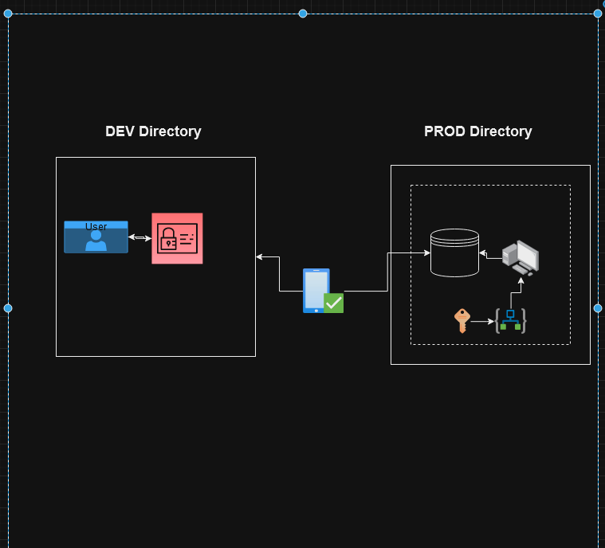

## Description of the Jumpserver deployment

-	Create an identity access management credential for users in detective tenants.
-	Configure cross tenants access with B2B ensure that the users’ credentials from the identity access management is joined to the user’s device that way the AD join device serves us an additional security layer to ensure the users can’t sign in except with the clearance device.
-	Create an access policy and configure it to a logic app in the Production environment directory.
-	Add the approval managers to the access policies, this access policies can be triggered by running the logic or web app to request access once they request and approval has been completed the output can be pushed with a function app trigger to Azure Monitor logs.
-	Set up the logic| web app to collect users credentials username and password.
-	Set up networking rules for production directory to restrict access to specific regions and grant access to only customers whose IP match the regions where the SQL DB is currently hosted.
-	Deploy jump server on an Azure virtual machine Scale Set (VMSS) and on the jump server install SQL Server management studio (SSMS) on the SQL DB restrict access to only SQL Server management studio window application | block web access to DB.
-	When access to the production directory has been granted by the approval manager the dev user accounts can access the jump server which the credentials provided and then from the jump server they can connect to the SQL DB via SQL Server management studio.
-	Set up conditional access reviews (either monthly or weekly) to revoke their views Dev user account access to the production environment stop
